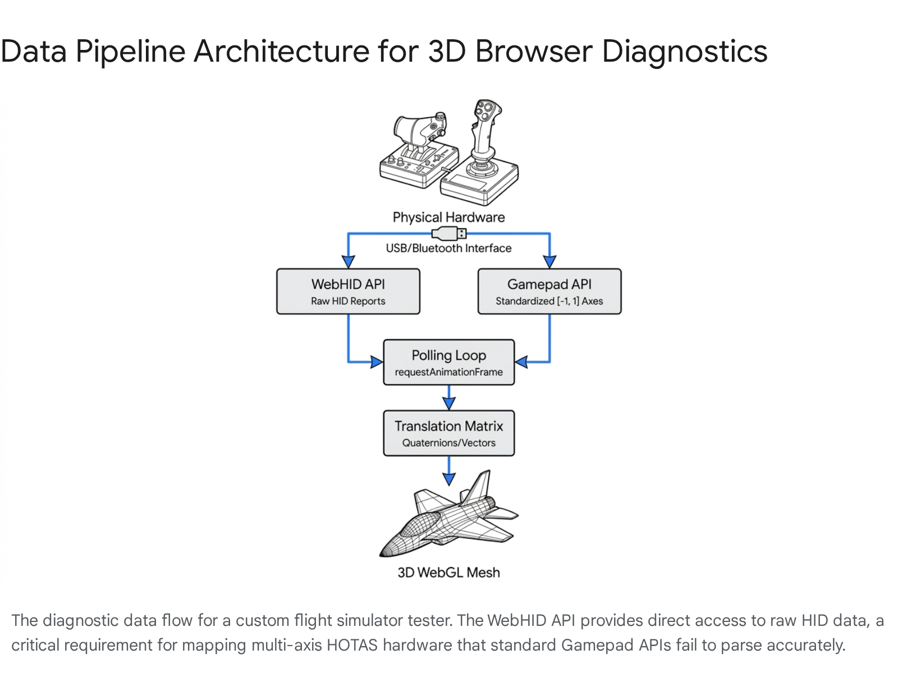

# An Assessment of Open-Source, 3D-Integrated Gamepad Testers for Simulation Development

*Disclaimer: The following document is for informational purposes only and does not constitute professional software engineering or aviation safety advice. Developing simulation systems for training or hardware diagnostics carries inherent complexity and should be conducted using rigorous validation processes.*

### Executive Summary
In direct response to the user's inquiry regarding the existence of open-source 3D gamepad testers and the necessity of building a custom tool:
1. **Does something like this exist?** Yes. Open-source 3D gamepad testing utilities built on WebGL and the HTML5 Gamepad API are actively maintained. The most notable web-based examples, such as `KevzPeter/Online-Controller-Tester` and `SafaElmali/dualsense-studio`, successfully map live hardware input to fully interactive 3D models in the browser. 
2. **Should I make my own for a flight simulator?** Yes. Developing a custom 3D diagnostic tool from scratch will unequivocally yield the most optimal results for a bespoke flight simulator like `0SFS`. Existing web tools excel at visualizing standard console controllers (e.g., Xbox, PlayStation), but they frequently lack native support for the complex, generic HID inputs required by Hands-On Throttle-And-Stick (HOTAS) setups. Standard tools will fail to properly map complex multi-axis flight simulation hardware, making a custom, dynamic mapping architecture essential. 

This report investigates the current technological landscape of open-source gamepad diagnostic tools, with a highly specific focus on three-dimensional interactive visualizations. The inquiry addresses the feasibility of integrating a 3D input tester—conceptually similar to the 2D tool found at hardwaretester.com/gamepad—into a web-based flight simulator project (specifically, the 0SFS repository). 

By examining both web-based repositories and native desktop solutions, this document evaluates the architectural paradigms, technological stacks, and mathematical logic required to visualize hardware inputs accurately in a digital 3D space. The subsequent sections will deconstruct the underlying browser APIs, analyze existing open-source web and desktop repositories utilizing a standardized analytical template, and provide a comprehensive architectural blueprint should the decision be made to develop a proprietary, custom-built solution favored by dedicated simulation engineers.

## 1. The Technological Foundation: The HTML5 Gamepad API

Before evaluating any web-based 3D visualizers, it is critical to understand the underlying data pipeline that makes browser-based controller testing possible. The HTML5 Gamepad API is the standardized programming interface that allows web applications to interface with USB and Bluetooth controllers [cite: 1]. 

### 1.1 Architecture and Polling Mechanisms
Unlike traditional mouse or keyboard inputs that rely on an event-driven architecture (where the browser fires an event only when a state changes), the Gamepad API relies primarily on a polling architecture. While browsers do fire standard `gamepadconnected` and `gamepaddisconnected` events, the actual state of the analog sticks and buttons must be continuously queried. Developers typically achieve this by calling `navigator.getGamepads()` inside a `requestAnimationFrame` loop, executing the query at the refresh rate of the monitor (typically 60 to 144 times per second). 

When a device is detected, the browser generates a `Gamepad` object containing a timestamp and two critical arrays:
- **The `buttons` Array:** A collection of `GamepadButton` objects. Each object contains a boolean `pressed` state, a boolean `touched` state (for capacitive buttons), and a `value` float ranging from `0.0` to `1.0`. The `value` property is crucial for analog triggers, allowing developers to visualize partial trigger pulls.
- **The `axes` Array:** A collection of floating-point numbers ranging from `-1.0` to `1.0`. These represent the directional inputs of analog sticks, sliders, or dials.

### 1.2 Standardization and Edge Cases: The HID Mapping Problem
The primary limitation of the Gamepad API lies in its handling of non-standard controllers, a phenomenon deeply relevant to flight simulation development. The API attempts to normalize recognized gamepads to a "Standard Gamepad" layout, which mimics an Xbox controller (consisting of 16 buttons and 4 axes) [cite: 2]. 

However, flight simulator peripherals, acting as generic HID (Human Interface Device, a standard class of USB peripherals that encompasses mice, keyboards, and gamepads) systems, rarely conform to this standard [cite: 3]. To ground this in reality, consider two highly popular, real-world hardware examples: the Logitech X56 HOTAS features 13 axes, 5 HATS, and 31 programmable buttons [cite: 4], whereas the Thrustmaster HOTAS Warthog features a dual-throttle system, 19 action buttons on the stick, and an 8-way POV hat utilizing highly sensitive magnetic sensors [cite: 5, 6]. 

Because the Gamepad API lacks native layout definitions for these devices, the browser passes the raw device data into the API arrays sequentially without standardized mapping. Consequently, Axis 3 on the Thrustmaster might control the left-engine throttle, while Axis 3 on the Logitech X56 might control the rudder twist. This inconsistency presents a significant hurdle for universal tester applications and strongly advocates for the development of custom, mappable diagnostic tools.

## 2. The Next Logical Question: Bypassing the Gamepad API with WebHID

Given the fundamental flaws of the HTML5 Gamepad API in handling complex, non-standard HID arrays like those found in flight simulator hardware, developers must logically ask: *Is there a modern web API that actually supports raw hardware data?*

The answer is the **WebHID API**. This advanced standard (supported in Chrome 89+, Edge 91+, and Opera 75+) was designed specifically to give applications an alternative when the functionality provided by the high-level Gamepad API is incomplete [cite: 7, 8]. While the Gamepad API only exposes normalized [-1.0, 1.0] axis values and basic button states, WebHID allows the browser to read raw HID input reports directly from the peripheral [cite: 8].

By using WebHID, a flight simulator tester can access vendor-defined usage pages to read low-level stick values, complex independent throttle sliders, specific rumble motor statuses, and even internal factory calibration offsets [cite: 8]. This is an essential architectural alternative for the `0SFS` project, as WebHID natively accommodates the multi-axis, button-dense realities of specialized aviation controls that standard Gamepad APIs truncate [cite: 3, 7]. 

## 3. The Baseline: Open-Source 2D Gamepad Testers

To establish a comparative baseline against the user's target (hardwaretester.com/gamepad), it is necessary to review the established open-source 2D alternatives. These repositories demonstrate the standard feature set expected of a diagnostic tool before introducing the complexity of 3D rendering.

The landscape of 2D web-based gamepad testers is well-populated by several established repositories, analyzed below using a strict template framework:

### 3.1 greggman / html5-gamepad-test
*   **Functional Scope**: Widely considered the classic foundational repository for browser-based input testing, providing raw data readouts and basic visual indicators for standard controllers [cite: 9, 10].
*   **Current Price/Cost**: Free / MIT License [cite: 9].
*   **Availability**: https://github.com/greggman/html5-gamepad-test [cite: 9].
*   **Real-World Context**: Ideal for developers needing a simple codebase to learn the raw Gamepad API layout. It holds 43 GitHub stars [cite: 9]. It should be avoided by end-users seeking polished UI/UX or 3D visuals.

### 3.2 e7d / gamepad-viewer
*   **Functional Scope**: A highly popular visual overlay tool designed primarily for streamers using OBS Studio. It utilizes CSS and DOM (Document Object Model) manipulation to visually overlay button presses on 2D controller skins (DualShock 4, Xbox One, Switch Pro) [cite: 11, 12].
*   **Current Price/Cost**: Free / Open Source (Docker images available) [cite: 11].
*   **Availability**: https://github.com/e7d/gamepad-viewer [cite: 11].
*   **Real-World Context**: Extremely popular among content creators, maintaining 54 GitHub stars and high community use [cite: 11, 13]. Avoided by hardware engineers who need diagnostics beyond simple visual button overlays.

### 3.3 KWM / virtual-gamepad-lib
*   **Functional Scope**: A modular, zero-dependency library that allows developers to emulate and display interactive virtual gamepads using SVG (Scalable Vector Graphics) and HTML elements natively in the browser [cite: 14, 15].
*   **Current Price/Cost**: Free / Open Source [cite: 15].
*   **Availability**: https://github.com/KW-M/virtual-gamepad-lib [cite: 15].
*   **Real-World Context**: With 15 GitHub stars, it is a stable tool for developers needing an embedded virtual controller [cite: 15]. Unsuited for diagnosing complex physical analog sticks.

### 3.4 gamepadtesteronline / Game-pad-tester-
*   **Functional Scope**: An HTML5 tester specifically designed to check for analog stick drift, gyroscope accelerometers, and D-pad functionality [cite: 16].
*   **Current Price/Cost**: Free / GPL-3.0 License [cite: 16].
*   **Availability**: https://github.com/gamepadtesteronline/Game-pad-tester- [cite: 16].
*   **Real-World Context**: Primarily an educational and utility base, maintaining 0 GitHub stars [cite: 16]. A very basic implementation that lacks complex support for non-standard controllers.

### 3.5 RealTabbukhan / GamePad-Tester
*   **Functional Scope**: A lightweight JavaScript implementation that detects button presses, joystick movements, and vibration support in real time without requiring installation, utilizing the Gamepad API [cite: 17].
*   **Current Price/Cost**: Free / Open Source [cite: 17].
*   **Availability**: https://github.com/RealTabbukhan/GamePad-Tester [cite: 17].
*   **Real-World Context**: Functions as an accessible browser utility for general gamers [cite: 17]. Maintained by an active developer but holds minimal repository stars [cite: 18].

These 2D projects collectively highlight a reliance on DOM manipulation and SVG rendering to achieve visual feedback. While effective for simple overlays, manipulating dozens of DOM nodes or SVG paths 60 times per second can introduce layout thrashing and CPU bottlenecks. Furthermore, 2D planes inherently struggle to convey the physical depth of partial trigger pulls or the complex, off-axis movements of an analog flight stick. For a sophisticated flight simulator, visualizing a three-dimensional yoke pulling back into the Z-axis requires a fundamental shift to WebGL technologies. WebGL (Web Graphics Library) is a JavaScript API for rendering high-performance interactive 3D and 2D graphics within any compatible web browser without the use of plug-ins.

## 4. Web-Based Open-Source 3D Gamepad Testers

Directly addressing the user's inquiry, open-source gamepad testers that utilize interactive 3D models do exist. These tools leverage WebGL rendering engines—predominantly Three.js—to bridge the gap between physical hardware and digital spatial representations. 

### 4.1 KevzPeter / Online-Controller-Tester
*   **Functional Scope**: Built using a modern web stack (Next.js and TypeScript), this provides an interactive 3D visualization to test PlayStation DualSense and Xbox controllers. The 3D model allows users to see their physical inputs reflected on a spatial, textured model within the browser [cite: 19].
*   **Current Price/Cost**: Free / Open Source [cite: 19].
*   **Availability**: https://github.com/KevzPeter/Online-Controller-Tester [cite: 19].
*   **Real-World Context**: Holding 9 GitHub stars, it has a polished, modern UI design [cite: 19]. However, a review reveals full interactivity is a work in progress. Moving analog sticks and complete interactive highlights are listed as "Planned Enhancements," making it unsuited for immediate complex flight sim integration [cite: 19].

### 4.2 SafaElmali / dualsense-studio
*   **Functional Scope**: Utilizes vanilla JavaScript and Three.js to create a highly specific, interactive PS5 DualSense recreation [cite: 20]. It maps real-time polling data directly to the rotation and position matrices of the controller's internal 3D components [cite: 20].
*   **Current Price/Cost**: Free / Open Source [cite: 20].
*   **Availability**: https://github.com/SafaElmali/dualsense-studio [cite: 20].
*   **Real-World Context**: Highly favored with 90 GitHub stars, serving as a functional proof-of-concept for 3D input testing in a web environment [cite: 20]. The primary anti-use case is that its logic is hardcoded to the specific architecture of a DualSense, rendering it difficult to adapt to a flight yoke.

### 4.3 EliCohavi / THREE.js-Gamepad-Joystick-Tester
*   **Functional Scope**: A minimalist Vite-hosted application that strips away photorealistic rendering to test joystick axes by mapping them purely to the mathematical rotation of a simple 3D cube [cite: 21]. 
*   **Current Price/Cost**: Free / Open Source [cite: 21, 22].
*   **Availability**: https://github.com/EliCohavi/THREE.js-Gamepad-Joystick-Tester [cite: 22].
*   **Real-World Context**: Valued on community forums (e.g., ~7 upvotes on Reddit) for its unobfuscated, mathematically pure code that helps developers learn how to extract Gamepad API data for Three.js interactions [cite: 21, 22]. It lacks comprehensive button mapping and is an educational proof-of-concept rather than a full diagnostic suite [cite: 21].

### 4.4 Advanced 3D Visual Showcases
While not strictly marketed as "testers," open-source projects push the boundaries of 3D controller visualization to near-photorealistic levels. The repository `thebuggeddev/controller` is an interactive, cinematic showcase that loads `.glb` (GL Transmission Format Binary, a standard file format for 3D models) assets compressed with Draco compression (an open-source geometry compression library by Google) [cite: 23]. The project achieves what can be defined as "AAA-quality 3D models" by utilizing 4K Physically Based Rendering (PBR) textures, dynamic lighting, and complex background rendering via TSL (Three.js Shading Language) without sacrificing real-time responsiveness [cite: 23, 24]. 

Similarly, `Manav-Sonawane/Playstation-Revamp` utilizes React Three Fiber to render a WebGL DualSense model that reacts in real-time to physical inputs, proving that modern browsers can handle heavy 3D loads while diagnosing input [cite: 25].

## 5. Native and Desktop-Based 3D Input Visualizers

To ensure no relevant subtopic is overlooked, it is necessary to examine native desktop tools. While the user's flight simulator (`0SFS.github.io`) is web-based, native applications pioneer features that web developers later adopt. Native applications communicate directly with operating system input drivers—such as XInput (for Xbox controllers), DirectInput (legacy Microsoft API for general inputs), and Windows.Gaming.Input (modern Windows API)—bypassing browser inconsistencies entirely.

### 5.1 Khyretos / 3dco-plus
*   **Functional Scope**: An AI-assisted C++ fork of a live 3D controller visualization tool designed for streamers. It caters explicitly to HOTAS setups and complex peripherals by allowing "Custom Model Import" and "Per-Part Pivot Editing" [cite: 15, 26, 27]. 
*   **Current Price/Cost**: Free / Open Source [cite: 27].
*   **Availability**: https://github.com/Khyretos/3dco-plus [cite: 27].
*   **Real-World Context**: With 15 GitHub stars, it uses industry-standard native libraries like SDL3 (Simple DirectMedia Layer 3, a cross-platform library for hardware access), OpenGL (Open Graphics Library for 2D/3D rendering), ImGui (Immediate Mode GUI library for C++), and Assimp (Open Asset Import Library) [cite: 15, 26]. Highly recommended for advanced users who need to manually set rotational pivot points for flight stick 3D models.

### 5.2 Gabriel2Silva / Haptika
*   **Functional Scope**: A powerful Linux gamepad tester written in pure C. Utilizing GTK 4 (GIMP Toolkit 4, a UI creation toolkit) and Libadwaita (GNOME design implementation library), it verifies every button, stick, and sensor on a gamepad [cite: 28].
*   **Current Price/Cost**: Free / Open Source [cite: 28].
*   **Availability**: https://github.com/Gabriel2Silva/Haptika [cite: 28].
*   **Real-World Context**: Holding 1 GitHub star, it is a niche but mathematically brilliant tool for Linux engineers [cite: 29]. It operates by talking directly to the Linux kernel's input subsystem (`evdev`, Event delivery interface) and SDL3. Its key claim is sub-millisecond input latency, achieved explicitly via a 1000 Hz polling rate and a 1ms timer [cite: 28].

### 5.3 nefarius / MultiPadTester
*   **Functional Scope**: A self-contained Windows C++23 desktop tool that parallelizes input polling across multiple backend APIs (XInput, DirectInput, Windows.Gaming.Input) to inspect controller input in real-time. Renders live gamepad views using DirectX 11 and Dear ImGui [cite: 30].
*   **Current Price/Cost**: Free / MIT License [cite: 30, 31].
*   **Availability**: https://github.com/nefarius/MultiPadTester [cite: 30].
*   **Real-World Context**: With 26 GitHub stars, it is an elite diagnostic tool for Windows hardware developers looking to verify inputs across differing API layers simultaneously [cite: 30, 32]. Not suitable for web deployment.

## 6. Advanced Diagnostics: Haptics, Circularity, and Mechanical Wear

If the objective is to build a "better version" of existing testers, visual representation alone is insufficient. A premier diagnostic tool must analyze the quantitative health of the hardware. 

### 6.1 Circularity and Real-World Stick Degradation
Analog stick degradation is a ubiquitous issue in hardware testing. A superior tester evaluates stick "circularity," which mathematically measures whether the coordinates of an analog stick, when pushed in a full 360-degree rotation, accurately map to a perfect bounding circle with a radius of `1.0` [cite: 2]. Deviations from this circle indicate physical wear. Furthermore, web-based testers can visualize "stick drift"—when released, if the stick fails to return precisely to the `0.00` deadzone, a centering error is flagged [cite: 8, 33]. 

To ground this in a real-world context: the PlayStation 5 DualSense controller utilizes ALPS RKJXV-series potentiometer modules [cite: 34, 35]. The carbon-track-and-wiper design physically degrades over approximately 2 million cycles, failing and causing severe stick drift within 4 to 7 months of heavy use [cite: 34, 36]. This specific hardware degradation phenomenon became so severe it sparked a massive class-action lawsuit filed in February 2021 by Chimicles Schwartz Kriner & Donaldson-Smith LLP against Sony [cite: 34]. A comprehensive 3D tester should be capable of detecting the micro-deviations (e.g., deviations `>0.015` from zero) caused by this exact carbon-track wear [cite: 8].

### 6.2 Haptic Feedback and Vibration Testing
Testing a controller's force feedback is another hallmark of advanced diagnostics. While the Web Vibration API exists, haptic feedback implementation remains inconsistent across modern web browsers, with Safari lacking support entirely [cite: 2]. In native Android environments, tools manipulate system properties and kernel drivers to force hidden rumble features [cite: 37]. For a web-based tester utilizing WebHID, direct access to the rumble motor's vendor-defined usage pages provides a vastly more reliable method to test force feedback than standard browser APIs [cite: 8].

### 6.3 Measuring True Hardware Latency
Software-based testers can estimate polling rates by measuring the time delta between `requestAnimationFrame` ticks [cite: 33]. However, software cannot measure total system latency. Projects like `Prometheus 82` utilize a physical mechanical solenoid to physically "punch" the gamepad buttons, using Python scripts to compare the exact microsecond the solenoid fires against the registered digital input [cite: 38, 39]. While implementing physical robotics is outside the scope of `0SFS`, understanding this distinction highlights the limits of software-only telemetry.

## 7. Architectural Blueprint for a Custom 3D Flight Sim Tester

Given the specific needs of the `0SFS` flight simulator, relying on pre-built testers designed for PlayStation controllers is inadequate. Developing a bespoke, custom-built 3D input tester is highly recommended. The following blueprint outlines the necessary phases to construct a robust, open-source diagnostic tool.

Phase 1: The 3D Asset Pipeline

The developer must acquire or model flight simulation peripherals in software
like Blender. Crucially, the mesh must be segmented: individual analog sticks,
triggers, and buttons must be distinct sub-meshes. The origin point (pivot) of a
physical stick must be placed precisely at its physical rotational joint within
the model. The final models should be exported in the .glb format utilizing
Draco compression to optimize web delivery bandwidth [cite: 23, 24].

Phase 2: The WebGL Rendering Engine

To render the 3D assets in the browser, developers should utilize Three.js. The
scene graph must be initialized with appropriate lighting. To preserve
performance, materials should be instantiated once at load time, avoiding
dynamic blending state changes that trigger expensive shader recompilations
[cite: 23].

Phase 3: The Translation Matrix (Input to Animation)

This phase represents the core mathematical logic. The application must
establish a continuous polling loop to query navigator.getGamepads() (or
ideally, the WebHID API) [cite: 3]. Raw data is mapped to 3D meshes using
geometric transformations:

  - Buttons and Triggers: A boolean button press translates to a linear
    translation (simulating physical depression). An analog trigger value
    translates to a rotational transformation along a local axis.
  - Solving for Analog Sticks and Yokes (Clarity Mandate): Translating vector
    data into complex 3D rotation requires advanced mathematical handling to
    avoid errors.
    1.  The Problem of Gimbal Lock: Core Definition: Gimbal lock is the loss of
        one degree of freedom in a three-gimbal, 3D mechanism that occurs when
        the axes of two gimbals align, locking the system. Analogy: Imagine a
        telescope on a physical mount. If you point the telescope straight up at
        the zenith (a 90-degree pitch), you can no longer pan left or right
        independently without physically rotating the entire heavy base.
        Relevance: If a developer uses basic "Euler angles" (X, Y, Z rotations)
        to render a 3D flight stick, pushing the yoke to its physical extremes
        can cause the axes to align in the math, making the digital model
        suddenly "flip" or spin wildly on screen.
    2.  The Solution via Quaternions: Core Definition: Quaternions are
        a 4-dimensional mathematical number system used in 3D graphics to
        calculate rotations without encountering gimbal lock. Analogy: Instead
        of telling an object to "turn X degrees, then Y degrees, then Z
        degrees", Quaternions define a single axis pole right through the object
        and say "spin along this specific pole by this amount." It describes the
        shortest, most direct path for rotation. Relevance: Utilizing
        Quaternions in the Three.js tester ensures the digital flight yoke moves
        exactly as the physical hardware does, smoothly tracking simultaneous
        pitch, roll, and yaw inputs without computational failure.

Phase 4: Dynamic Hardware Mapping Interface

Because flight simulator hardware acts as highly specific HID devices,
hardcoding array indexes will result in software failure when different hardware
is connected. Taking inspiration from the "per-part pivot editing" of 3dco-plus
[cite: 15, 27], the custom web tool must feature a Dynamic Mapping Interface. A
user enters a "Calibration Mode," selects the specific sub-mesh (e.g., the left
throttle lever), physically moves the lever, and binds the incoming WebHID data
index to that mesh, saving the profile to localStorage. This agnostic approach
guarantees compatibility with any hardware the browser can recognize.

Sources:

1.  nerdbot.com
2.  hardwaretester.com
3.  scottlogic.com
4.  sportys.com
5.  thrustmaster.com
6.  thrustmaster.com
7.  github.io
8.  alibaba.com
9.  github.com
10. epanorama.net
11. github.com
12. github.com
13. github.com
14. github.com
15. github.com
16. github.com
17. github.com
18. github.com
19. github.com
20. github.com
21. reddit.com
22. reddit.com
23. github.com
24. bevy.org
25. github.com
26. reddit.com
27. szmer.info
28. github.com
29. github.com
30. github.com
31. github.com
32. github.com
33. dev.to
34. thecontrollerpeople.com
35. thecontrollerpeople.com
36. fixitlads.ca
37. github.com
38. thingiverse.com
39. itch.io
